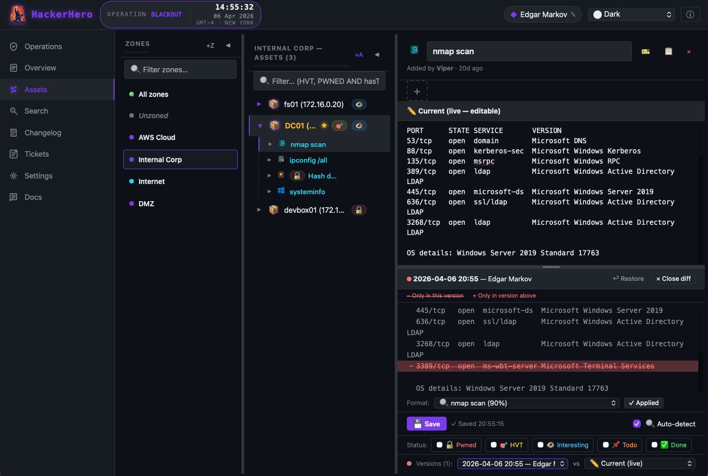
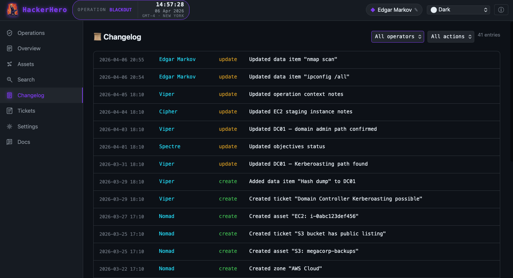
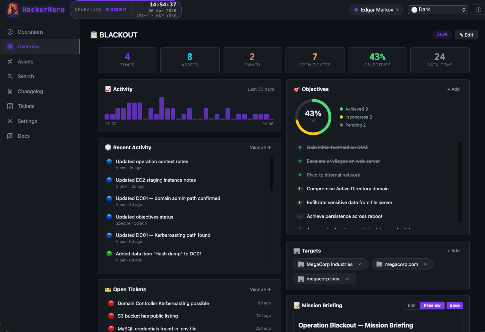
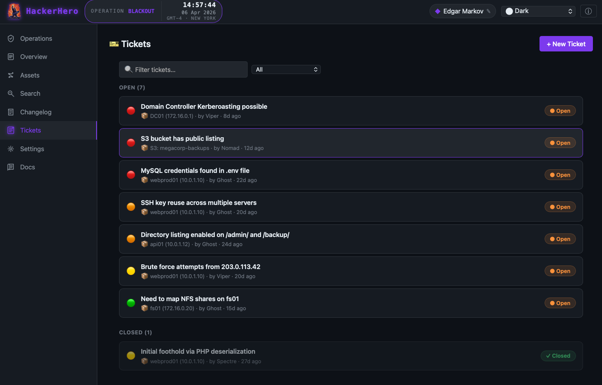
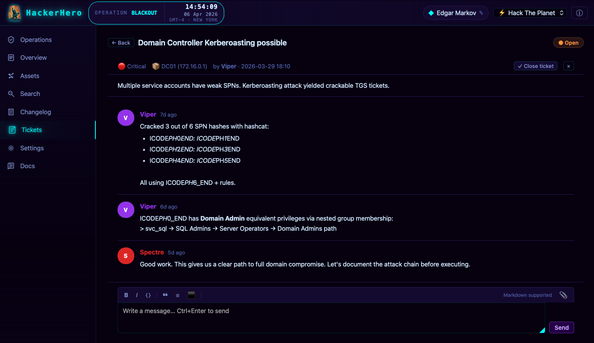

<p align="center">
  
</p>

# HackerHero 🎸

> **Red Team Operations Manager** — local-first, zero-dependency, offline-capable, open source.

HackerHero is a browser-based SPA for pentesters to **capitalise, search, and manage** data collected during red team operations — all stored locally in IndexedDB, with no server, no framework, and no internet required.

---

## ⚡ Quick Start

```bash
# 1. Clone the project
git clone https://github.com/stillhacking/HackerHero
cd HackerHero

# 2. Serve it over HTTP (required for ES6 modules + IndexedDB)
python3 -m http.server 8000

# 3. Open in your browser
open http://localhost:8000
```

> **Why HTTP?** ES6 `import` statements are blocked on `file://` by browsers. Any static file server works — Python, Node.js `serve`, Nginx, Apache, etc.

### 🐳 Docker

```bash
# Build the image
docker build -t hackerhero .

# Run the container (accessible at http://localhost:8080)
docker run -d -p 8080:80 --name hackerhero hackerhero
```

> Data is stored in your **browser's IndexedDB** — not in the container. Use **Export All** to back up your data before removing the container.

---

Want to try it instantly? Open **Settings → Demo Mode → 🎭 Load Demo Data** to generate 3 realistic operations with zones, assets, parsed data, tickets, and changelog entries.

---

## 🎯 Features

| Feature | Description |
|---|---|
| **Operations** | Create, edit, archive, export, import, delete operations with codename, targets, objectives, mission briefing (Markdown), and timezone. Click the operation name in the header to **rename inline** at any time |
| **Duplicate protection** | Prevents creating or importing operations with duplicate codenames |
| **Overview** | Mission dashboard: KPI strip, activity sparkline (30 d), recent activity feed, objectives progress ring (pending → in-progress → achieved → dropped), open tickets, top operators, targets, mission briefing with Markdown preview |
| **Zones & Assets** | Network zones with color, multi-zone asset assignment (`zoneIds[]`), nested asset tree with parent/child, keyboard navigation, collapsible columns, status badges (Pwned 🔓, HVT 🎯, Interesting 👁, Todo 📌, Done ✅) |
| **142 SVG Icons** | 12 icon categories (servers, networking, cloud, endpoints, apps…) with filterable picker and parser-to-icon auto-mapping |
| **118 Parsers** | Auto-detect and parse outputs from 118 security tools in 26 categories: nmap, Nuclei, SQLMap, Gobuster, ffuf, httpx, Amass, Subfinder, Katana, Shodan, LinPEAS, Impacket, TruffleHog, AWS CLI, and 100+ more |
| **Version History** | Every asset and data item edit saves a snapshot; LCS-based line-level diff with color-coded comparison; restore any previous version |
| **Search** | Full-text + query language (`HVT`, `PWNED AND hasTickets`, `inZone=DMZ`) + advanced panel (date range, operator, zone, type, regex) |
| **Changelog** | Full audit log with per-operator attribution and full state snapshots; filter by operator, action, or source operation; click ⌫ to revert any change; click any entry to navigate to the entity |
| **Tickets** | Issue tracker with priorities (Low 🟢 / Medium 🟡 / High 🟠 / Critical 🔴), linked to zones/assets/data items, forum-style message threads with Markdown and image attachments |
| **Image Attachments** | Attach images to assets, data items, and ticket messages; thumbnail strip, full-screen lightbox gallery with ←/→ keyboard navigation, 10 MB limit per image |
| **Import / Export / Merge** | 3 import workflows: **create** new operations (auto-suffix duplicates), **update** an existing operation from file, **merge** two live operations with smart conflict detection. Full ID remapping, cross-operator support, `updatedAt`-based newest-wins logic, merge attribution (🔀 badge) in changelog |
| **Demo Mode** | Generate 3 realistic operations (BLACKOUT, GHOSTWIRE, REDSAND) with 6 operators, real parsed data, tickets, and 30+ days of changelog — removable in one click |
| **8 Themes** | Dark · Light · Focus · Matrix (animated rain) · Upside Down (reflections + nav flicker) · Operation (classified) · WarGames (amber) · Hack The Planet (cyan) |
| **Operator Identity** | No auth — each operator picks a name (default: random Magic creature name); all changes are attributed |
| **Built-in Docs** | 9-tab documentation panel: User Guide, Data Model, Architecture, Source Code, Parsers, Icons, Themes, Query Language, FAQ |

---

## 🖼️ Screenshots


<p align="center">
  <br>
  <em>Assets panel: nmap scan with version diff and color-coded changes</em>
</p>

<p align="center">
  <br>
  <em>Changelog: full audit log with operator attribution</em>
</p>

<p align="center">
  <br>
  <em>Overview: KPIs, activity, objectives, tickets, targets, and mission briefing</em>
</p>

<p align="center">
  <br>
  <em>Tickets panel: open and closed tickets with priorities</em>
</p>

<p align="center">
  <br>
  <em>Tickets: threaded discussion with Markdown and status</em>
</p>
---

## 📁 Project Structure

```
HackerHero/
├── index.html              HTML shell: header, sidebar, 8 panels, modal, overlays (~410 lines)
├── favicon.svg             Logo (Eddie Munson / Stranger Things style)
├── Dockerfile              Docker image definition (nginx:alpine, serves on port 80)
├── README.md               This file
├── css/
│   └── app.css             All styles + 8 themes via CSS custom properties (~3,480 lines)
├── js/
│   ├── app.js              Thin orchestrator: imports, routing, init, inline rename (~190 lines)
│   ├── core.js             Shared core: State, UI, ThemeManager, Lightbox, TZClock,
│   │                       ImportExport, renderMarkdown, renderAttachmentStrip (~820 lines)
│   ├── db.js               IndexedDB wrapper: 12 stores, 57 async methods, schema v7,
│   │                       import + smart merge engine (~1,440 lines)
│   ├── utils.js            Helpers: UUID, dates, DOM, escHtml, sanitize, validate (~380 lines)
│   ├── magic-names.js      ~290 Magic: The Gathering creature names (~340 lines)
│   ├── parsers.js          118 command output parsers in 26 categories (~4,780 lines)
│   ├── asset-icons.js      142 SVG icons in 12 categories (~570 lines)
│   ├── demo-data.js        Demo data generator: 3 ops, 6 operators (~920 lines)
│   ├── panel-missions.js   Operations CRUD + duplicate protection (~375 lines)
│   ├── panel-overview.js   Dashboard: KPIs, sparkline, activity, objectives (~510 lines)
│   ├── panel-assets.js     Zones, asset tree, data viewer, parsers, diff (~2,260 lines)
│   ├── panel-search.js     Search: full-text, query language, advanced (~440 lines)
│   ├── panel-changelog.js  Audit log with 3 filters + revert (~200 lines)
│   ├── panel-tickets.js    Tickets: list, detail, forum messages (~470 lines)
│   ├── panel-settings.js   Identity, themes, data management, demo (~200 lines)
│   └── panel-docs.js       Built-in documentation (9 tabs, ~780 lines)
└── docs/
    └── index.html          Offline standalone documentation
```

**~18,500 lines of code** — zero dependencies, zero build step, zero framework.

---

## 🗄️ Data Model

All data is stored in **IndexedDB** (`HackerHeroDB`, schema v7) with 12 object stores. The merge engine supports smart conflict detection with `updatedAt`-based newest-wins resolution:

| Store | Key | Indexes |
|---|---|---|
| settings | key | — |
| missions | id | by-codename, by-created |
| zones | id | by-mission |
| assets | id | by-mission, by-zone (multiEntry), by-parent |
| subitems | id | by-asset, by-parent |
| assetVersions | id | by-asset, by-timestamp |
| subitemVersions | id | by-subitem, by-timestamp |
| changelog | id | by-mission, by-timestamp |
| tickets | id | by-mission, by-ref |
| ticketMessages | id | by-ticket |
| attachments | id | by-mission, by-ref |
| intelligence | id | by-mission |

---

## 🔌 Extending

### Add a Command Parser

Edit `js/parsers.js` — create a parser object and add it to the `PARSERS` array:

```js
const MY_TOOL = {
  id: 'my_tool', label: 'MyTool output', icon: '🔧',
  detect: (text) => /unique-pattern/i.test(text) ? 0.9 : 0,
  parse:  (text) => ({ raw: text }),
  suggestName:     ()   => null,
  suggestItemName: ()   => 'mytool',
};
export const PARSERS = [ /* …existing… */, MY_TOOL ];
```

### Add a Theme

1. Add a `[data-theme="my-theme"]` block in `css/app.css` with all `--c-*` custom properties.
2. Register it in `ThemeManager.themes` in `js/core.js`.
3. Add an `<option>` in the header `<select>` in `index.html`.

### Add a Panel

1. Add `<section id="panel-mypanel" class="panel">` in `index.html`.
2. Add a nav item `<li class="nav-item" data-panel="mypanel">` in the sidebar.
3. Create a `panel-mypanel.js` module exporting an object with `render()` and `bindEvents()`.
4. Import it in `app.js` and register it in the panel router.

Full details in the **Docs** panel (last tab in the sidebar) or [docs/index.html](docs/index.html).

---

## 🛡️ Privacy & Security

- **Zero network requests** — all data stays on your machine.
- **No tracking, no telemetry, no external fonts, no CDN.**
- **No npm, no bundler, no build step** — pure vanilla ES modules.
- Works in **air-gapped VMs** and isolated lab environments.
- All imported data is recursively sanitized (XSS-safe).
- Data is stored in your browser's `IndexedDB`. Use **Export All** before clearing browser data.

---

## 📄 License

MIT — do whatever you want, share the love.

---

*Inspired by Eddie Munson — always play to the cheap seats.* 🎸
